# AWS Static Website Hosting

**Stack:** Amazon S3 + Amazon CloudFront (Origin Access Control)

---

## What this is

A static website ("Code Tech IT Solutions") hosted on S3 and served globally through CloudFront over HTTPS. The S3 bucket stays fully private — CloudFront is the only thing allowed to read from it, enforced through a bucket policy scoped to this one specific distribution via Origin Access Control (OAC).

```
Visitor → CloudFront (HTTPS, caching, OAC) → S3 bucket (private origin)
```

No public bucket, no S3 website-endpoint URL in use — just OAC-authenticated reads from a locked-down bucket.

---

## Step 1: Create the S3 bucket

Created `codetech-it-solutions-intership` in US East (Ohio), with all four Block Public Access settings left on.

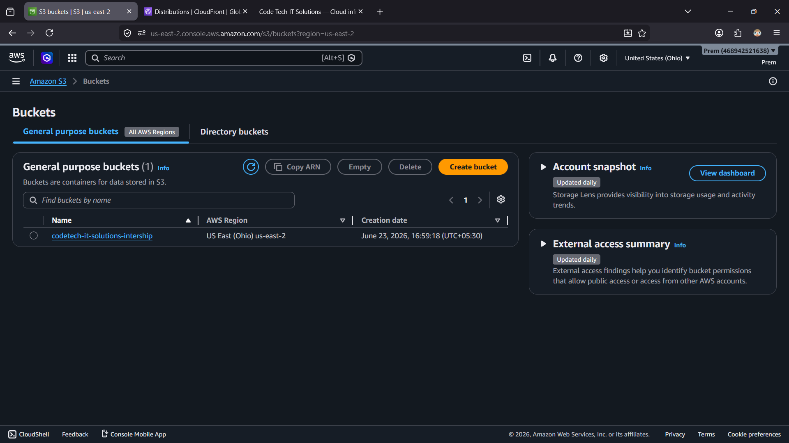

---

## Step 2: Create the CloudFront distribution

Distribution `E2BSQS7MEAETPR` created (Standard type), origin pointed at the S3 bucket, status flipped to **Enabled**. Default root object set to `index.html`, with `d3fw7tzxibtqht.cloudfront.net` assigned as the distribution domain.

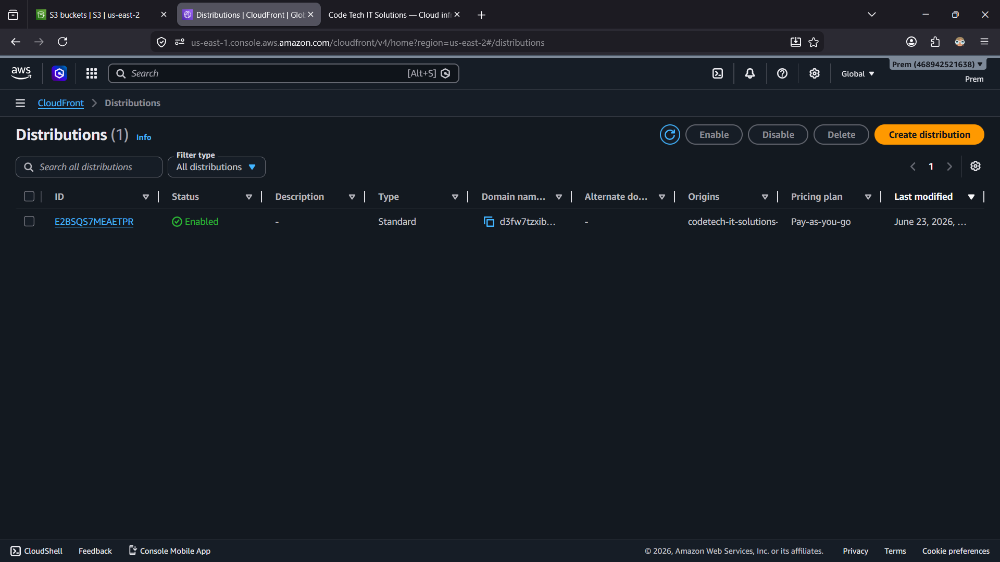
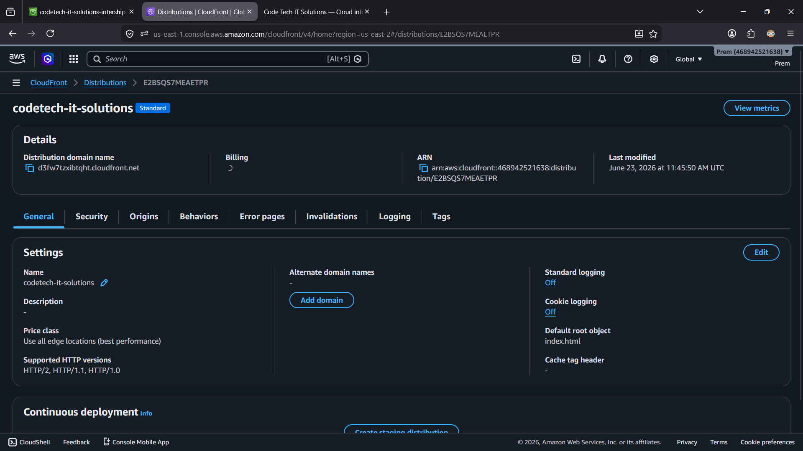

---

## Step 3: Upload the website files

`index.html` and `error.html` uploaded to the bucket.

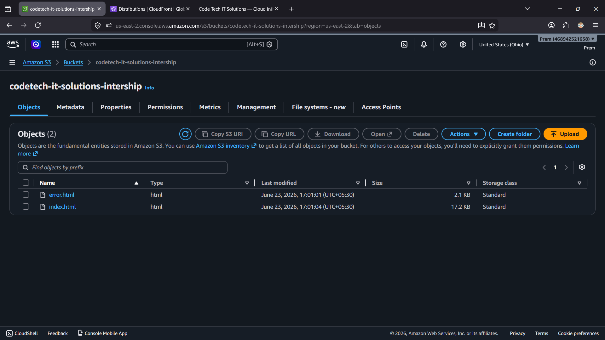

---

## Step 4: Lock the bucket to CloudFront only

Bucket policy applied with a `Condition` scoped to this exact distribution's ARN — only `Cloudfront-distribution` can read from this bucket, nothing else.

```json
{
  "Version": "2012-10-17",
  "Statement": [
    {
      "Sid": "AllowCloudFrontServicePrincipal",
      "Effect": "Allow",
      "Principal": {
        "Service": "cloudfront.amazonaws.com"
      },
      "Action": "s3:GetObject",
      "Resource": "arn:aws:s3:::codetech-it-solutions-intership/*",
      "Condition": {
        "StringEquals": {
          "AWS:SourceArn": "arn:aws:cloudfront::Account-ID:distribution/Cloudfront-distribution"
        }
      }
    }
  ]
}
```

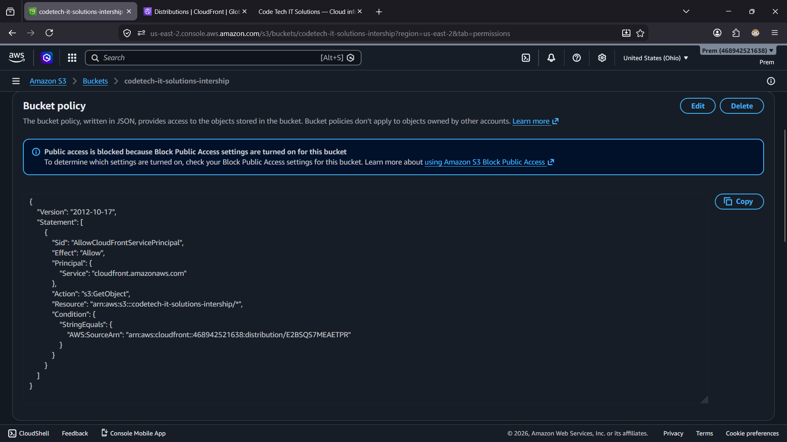

---

## Step 5: Test the live site

Loaded the CloudFront domain and scrolled through the whole page — hero section, services, process steps, stats, and the contact form at the bottom.

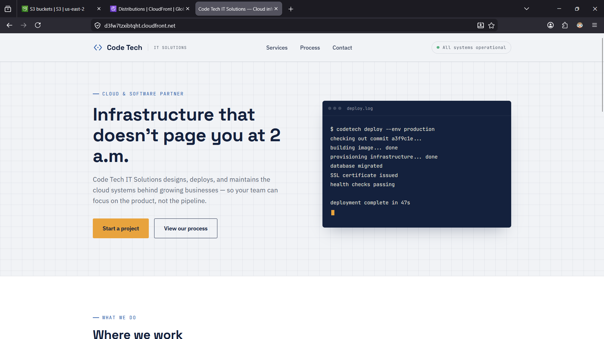
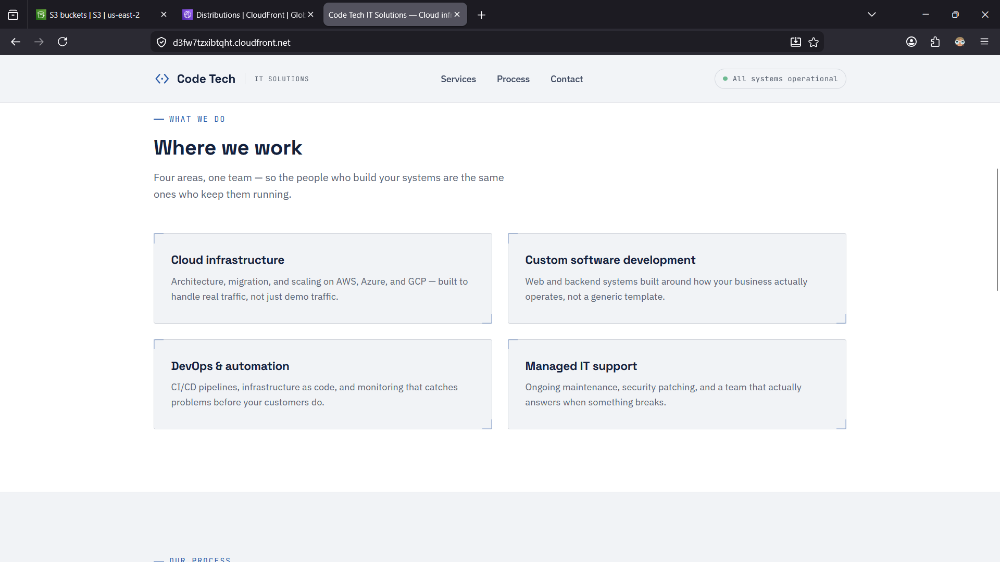
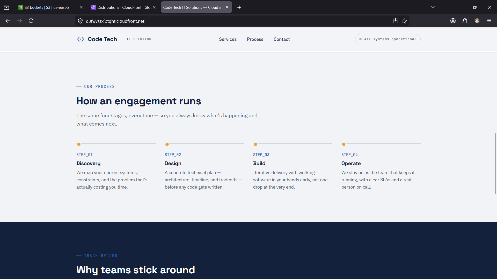
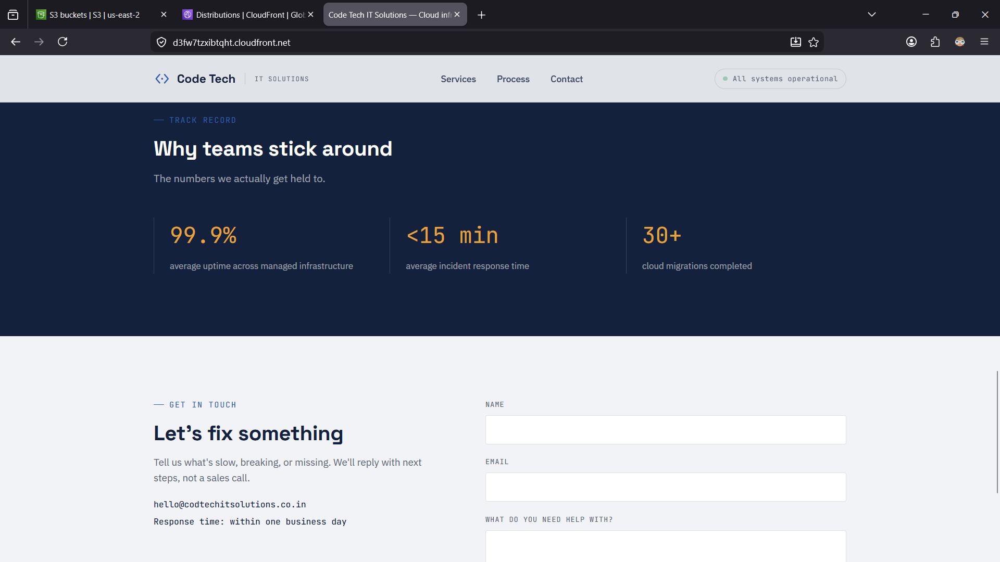
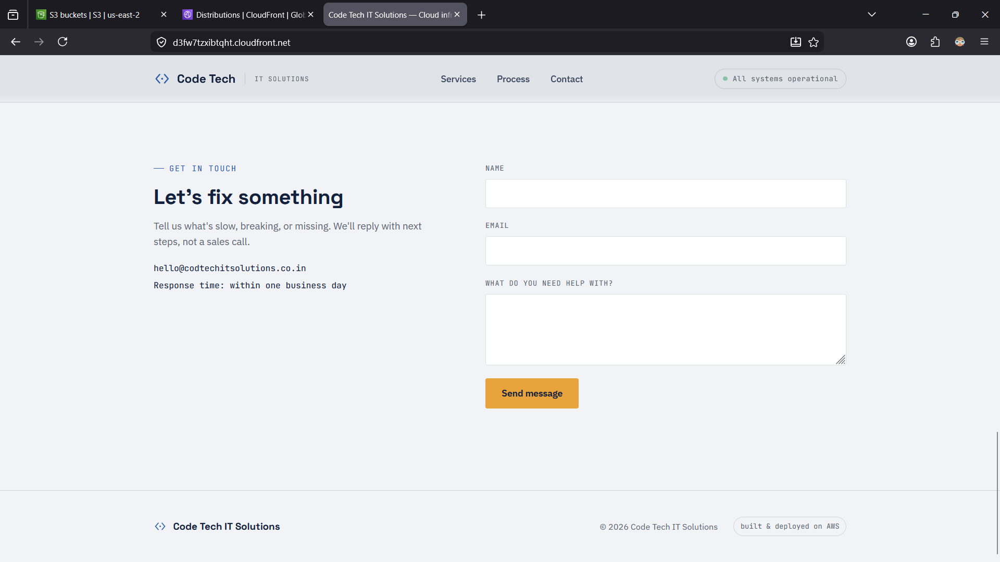
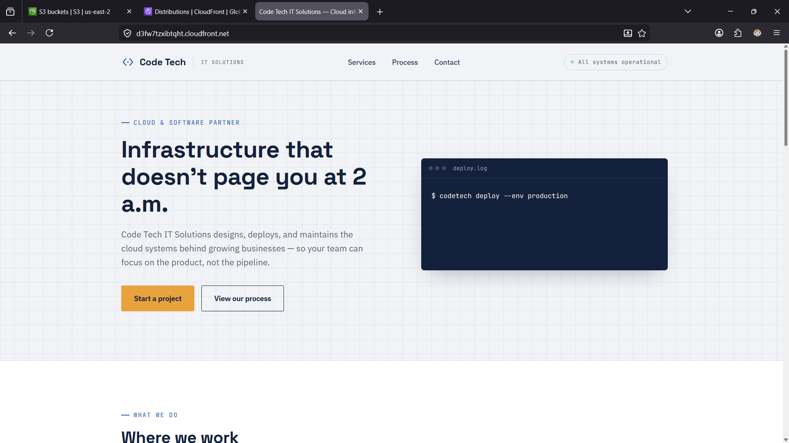

---

## Step 6: Check CloudFront monitoring

Confirmed requests were actually hitting the distribution and that the error rate stayed at 0%.

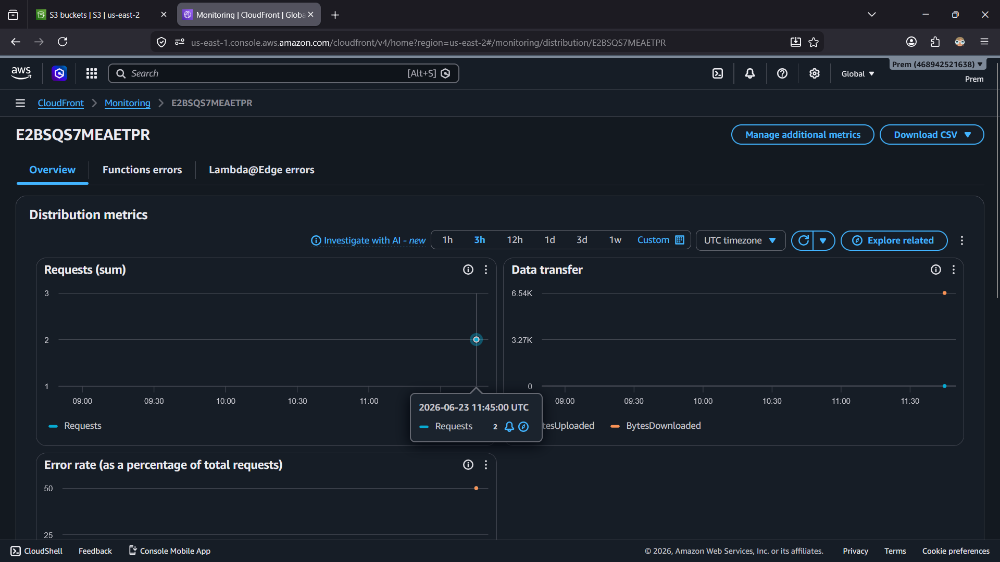
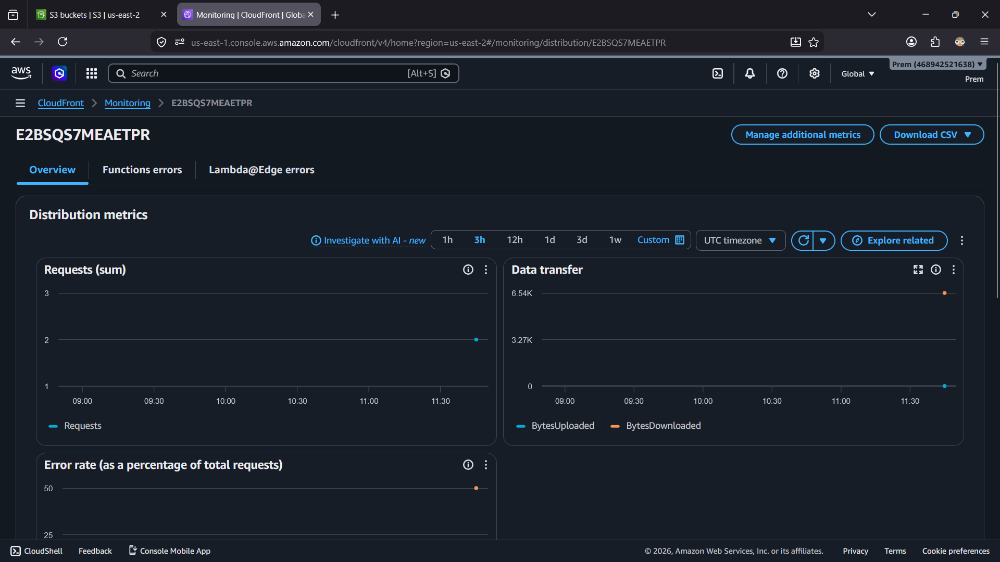
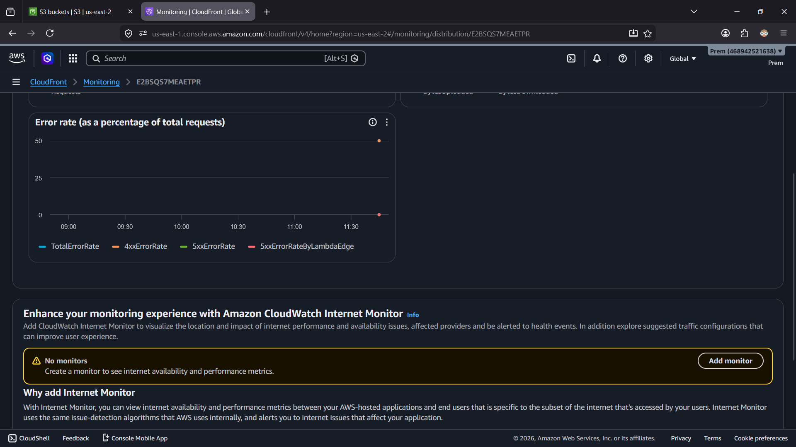

---

## Step 7: Review the CloudFront console layout

Took a pass through the left-hand navigation — Distributions, Policies, Functions, Telemetry (Monitoring/Alarms/Logs), Reports & analytics, Security — to get oriented for later projects that'll touch these same sections.

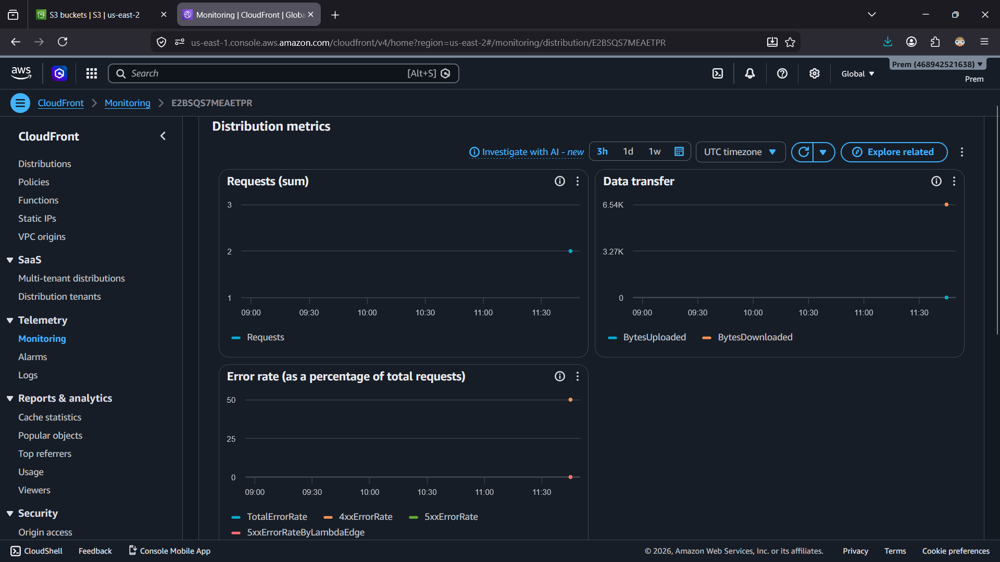

---

## Step 8: Confirm the public-website route stayed off

Double-checked S3's built-in static website hosting feature is **Disabled** — the site is served only through CloudFront + OAC, never through S3's own public website endpoint.

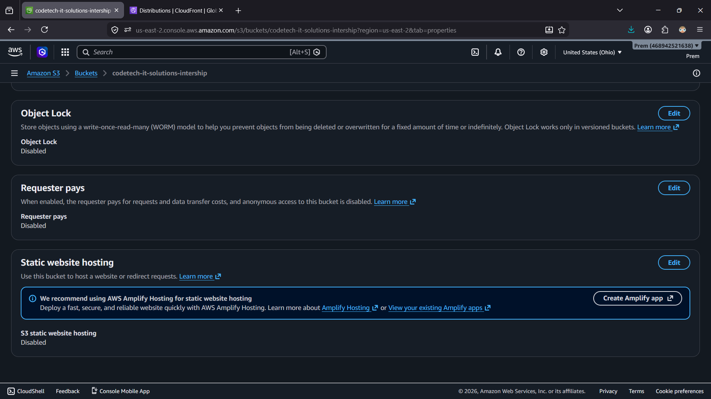

---

## Notes / what this taught me

- **OAC over a public bucket.** Keeping Block Public Access fully on and using OAC instead means the bucket is never exposed directly — CloudFront is the only path in, and it's locked to one specific distribution ARN.
- **`Default root object` is easy to forget.** Without setting it to `index.html`, the root URL just returns nothing useful.
- **CloudFront takes a few minutes to deploy.** Status sits on "Deploying" before flipping to "Enabled" — worth checking before assuming something's broken.
- **Monitoring confirmed the loop end-to-end.** Seeing real request counts and a 0% error rate in CloudFront's metrics was the actual proof the whole chain (bucket → policy → distribution → viewer) was wired correctly, not just "the page loaded once."
